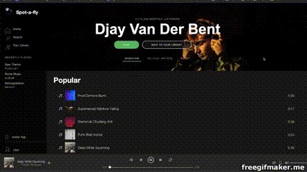

# Spot-A-Fly - Top Tracks Microservice
A clone of the Spotify artist page.

## Getting Started
Clone this repository from by running: git clone https://github.com/levipe01/Spot_A_Fly_Top_Tracks.git 

## Prerequisites
Node.js npm
PostgreSQL

## Installing
Install all dependencies. Seed database. Run server.

## npm install
npm run db-seed
npm start
Navigate to http://localhost:3003 to visit the Spot-A-Fly top tracks service.

## Built With
PostgreSQL
Express.js
React
Node.js

## Authors
Peter Levin - GitHub

## License
This project is licensed under the MIT License - see the LICENSE.md file for details
